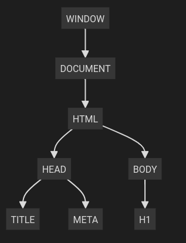
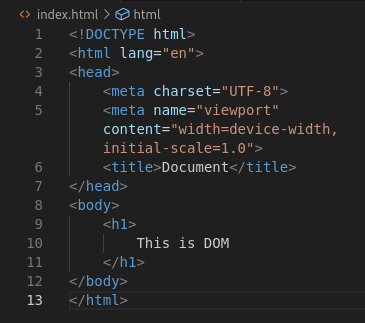
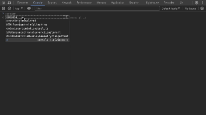
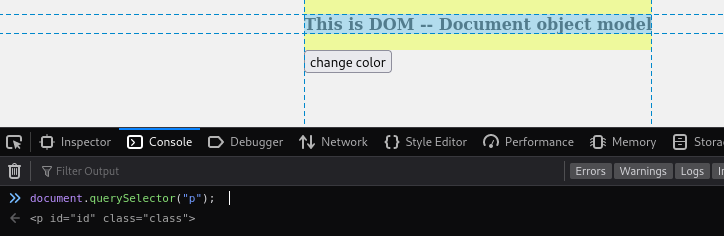
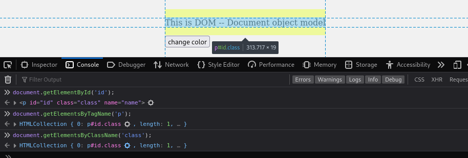
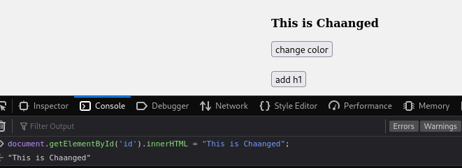
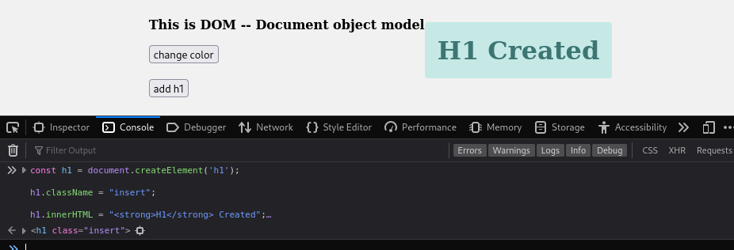
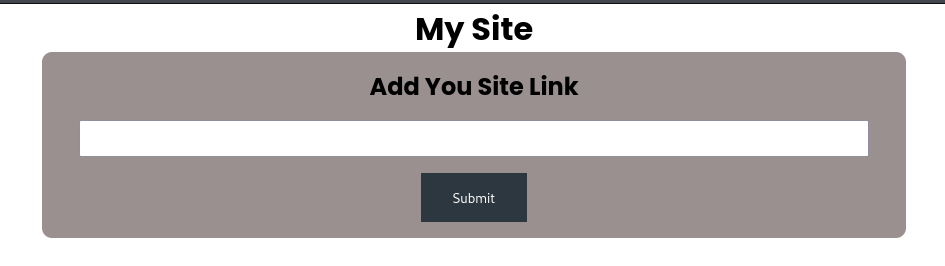

# DOM 

DOM Stands for Document Object Model. It consists of 3 things 

**Document**  :  A HTML document, which defines the structure of webpage

**Objects**   :  Objects are the elements of the html here, Objects have some properties and methods and methods are the function the object have. 

**Model**     :  Representation of HTML Document.

## What is the DOM?

it is an ```object-oriented```  , ```Hierarichal```  and ```tree```  like  representation of the web page,.

| <center>Browser See</center>  | <center>HTML Doc</center>          |
| ----------------------------- | ---------------------------------- |
|  |  |

| <center>We See</center>     |
| --------------------------- |
|  |


As you can see by above images the browser see the document like in the image *Browser See*
by actually this browser understand the document or use the DOM.
DOM is not only limited to browser it is a model that can be utilized by server some programs etc.
So,From the Eye of the Browser doucument look like as showm in _browser see_.

When a web page is loaded, the browser creates a **D**ocument **O**bject **M**odel of the page.

Due to DOM the javascript can interact with the html,understand the doc.
Doument can be modified with a scripting language such as JavaScript using DOM.
Means, it gives ```notion``` of web pages,HTML Documents, SVG Documents for javascript
 javascript by default doesn't know what the html document is 


 DOM represents the document as ```nodes``` and ```objects``` that way, programming languages can interact with the page.
 Node is an individual objects. then what is object ? object is nothing but collection of methods and properties according to the context of the objects , which give user or dev to interact , modify and access. 
e.g  body has its child object (onclick, style)

**Dynamic channges** : the changes made in webpage in runtime we can make using DOM
	- e.g a button > changing the background colour

- run the below code in console of any web-page
```
document.body.style.background = "#2a2b2a"; // make the background #2a2b2a
setTimeout(() => document.body.style.background = '', 3000); // return back
```

| <center><b>Below Showing the BOM</b></center> |
| --------------------------------------------- |
|    |

- the above image is showing `window` object of Wikipedia Page

From The Image *Browser See* 
we have `window object`  it is a global object for javascitpt and also known as root object 

Like the DOM we have BOM which is browser object model DOM is for document and BOM is for browser

DOM Also enable us to create,remove and modify the elements of html and css. Let us see How we actually accessing it.

## Accessing the DOM

Download : [DOM/Attachments/Our Testing Site Files ](https://github.com/pravinsinghmaravi/Web/tree/b366679a975537b0718637203175c7ea2c8fe389/DOM/Attachments/Our%20Testing%20Site%20Files)

In the above folder the files are placed we wiill be using them to understand the following things

Run Command in Console to see 
### by querySelector


-> Like the above you can try every below thing in console

-  for selecting p tag
```js
document.querySelector("p");  
```


- selecting all `p`  nodes
```js
document.querySelectorAll("p");  > for selecting h1 tag
```


- to select the `p` with id
```js
document.querySelector("#id");  
```


- to select the `p`  with class
```js
document.querySelector(".class");   
```

### getElementsBy



It  give us the direct selection againg Selecting our paragraph

- by `id`
```js
document.getElementById('id');	
```

- by `tagname`
```js
document.getElementsByTagName('p');
```

- by `classname`
```js
document.getElementsByClassName('class');
```


## Modifying Document 

### **innerHTML**



To change the content in web page we can use `innerHTML`
- you can try this as above by running in console
```js
document.getElementById('id').innerHTML = "This is Chaanged";	
```


### **Create Element**

by using `document.createElement` we can add element to the web page



- if you give this code to console then the h1 element will be added
```js
const h1 = document.createElement('h1');

h1.className = "insert";

h1.innerHTML = "<strong>H1</strong> Created";

document.body.appendChild(h1);
```

### **Remove Element**

As you have already run the above code then 

- in order to remove the created `h1` the one we have created above
```js
setTimeout(() => h1.remove(), 50);
```


### **Event Handling** 

In our script the code for `change-color`  button is shown below

```js
const body_color = document.querySelector(".change-color");
var count = 0;
body_color.addEventListener("click",function()
{
if(count == 0)
{
document.body.style.background = '#e3b6b3';
count++;
}
else{
setTimeout(() => document.body.style.background = '', 50); // return back
count--;
}
});
```

here as  we have already learnt how to select an element then now
we have selected the the change color button and add an  event lisner to it which on click will change the background.

you can try by clicking on it 


## **DOM XSS**

The DOM XSS means the atttacker can use the dom functionality in order to inject the javascript payload into the web page by this attcker can if possible can do following things
- Account Takeover by cookie hijacking or session hijacking using DOM XSS
- Change the Layout of the Web Page
- Redirect the Website Traffic to own phising page and have user's credential


You can use the Following files : https://github.com/pravinsinghmaravi/Web/tree/ee3a26a6bf99cfe2a880d2eca270a09630ff229e/DOM/Attachments/DOM%20Site%20Files


Below is the site 



- This site give functionality to add `weblinks`  to the webpage by taking input by the user 

In this site it is fetching the value of `search` parameter 

```js
var query = (new URLSearchParams(window.location.search)).get('search');
```

From taking value of parameter  from the user it adds the `a`  tag without sanitizing the input to the site making it vulnerable to the DOM XSS

```js
document.write('<a id="anchor" href='+query+'><h1>your Site</h1></a>');
```


If you give the below Payload on hovering over the element it will  where it is place and alert will pop out 

put this in search string
```
"#" onmouseover=alert(1)
```

## Reference 

[armour](https://www.armourinfosec.com)

[portswigger.net](https://portswigger.net/web-security/cross-site-scripting/dom-based)

[hackstricks](https://book.hacktricks.xyz/pentesting-web/xss-cross-site-scripting/dom-xss#javascript-injection)

[freecodecamp](https://www.freecodecamp.org/news/the-javascript-dom-manipulation-handbook/)

[javascript.info](https://javascript.info/dom-nodes)

[w3school](https://www.w3schools.com/js/js_htmldom.asp)

[mdn](https://developer.mozilla.org/en-US/docs/Web/API/Document_Object_Model)

